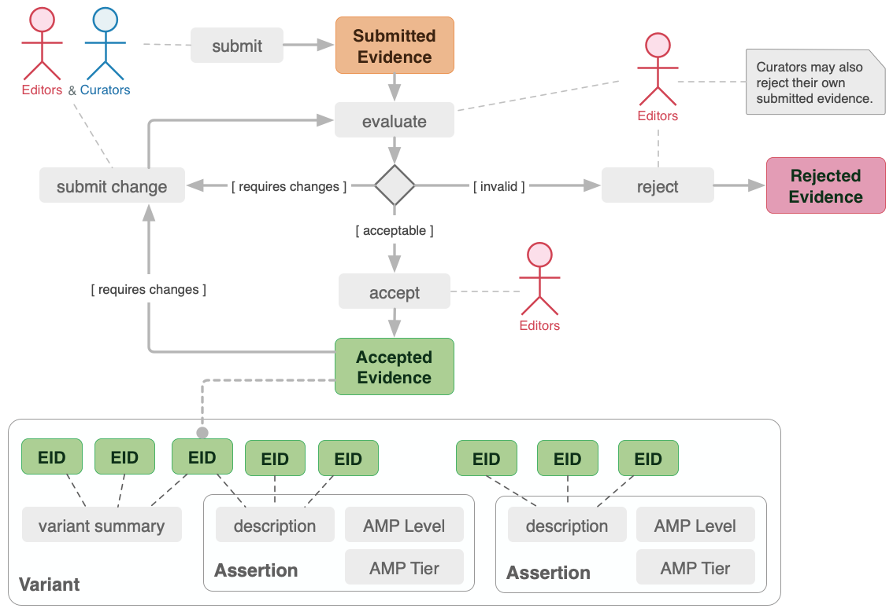
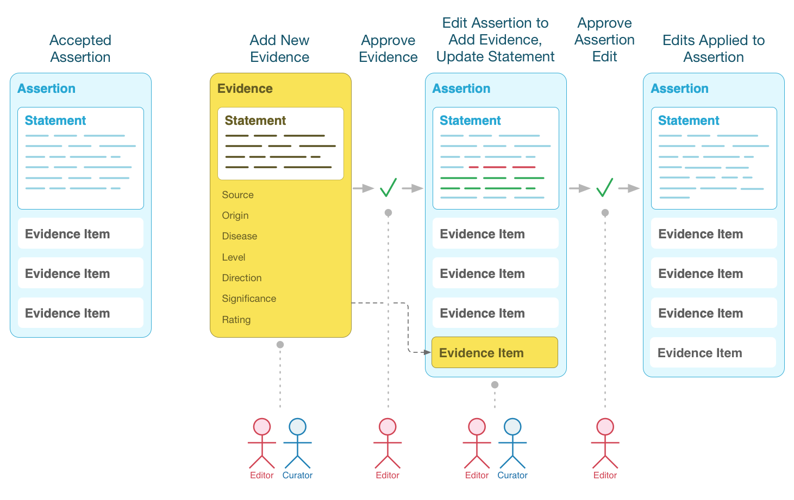
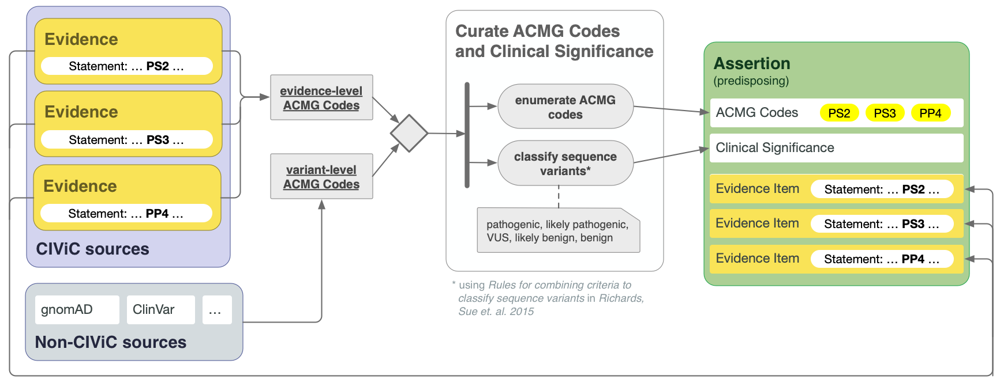
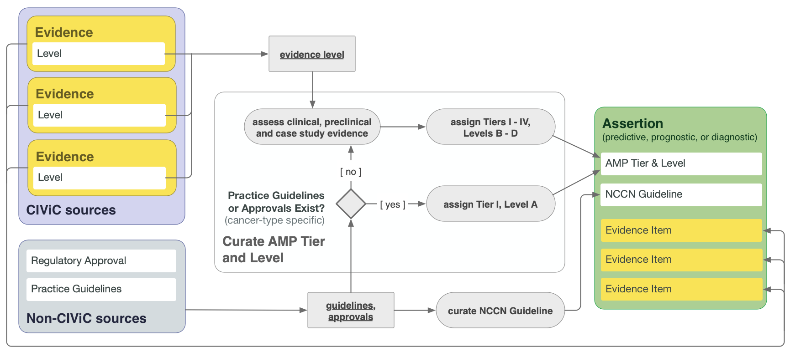

Figures and Graphics
====================
Provided below are figures and graphics to be used for referencing, publicizing, or presenting CIViC. 

CIViC Model Figures
-------------------
These figures provide details about CIViC's data model, showing how the various entities in CIViC are related and how they may be associated to external data sources or user input.

We've released these figures under the `Creative Commons Public Domain Dedication (CC0 1.0 Universal) <https://creativecommons.org/publicdomain/zero/1.0/>`_, which means they are in the public domain and may be used, distributed, modified for any purpose without permission.

CIViC Process and Ecosystem Figures
---------------------
Process figures show the activity related to curating, editing, and using CIViC, and its relationships to external data/knowledge sources, or other processes in the biocuration ecosystem.

These figures are also released under the `Creative Commons Public Domain Dedication (CC0 1.0 Universal) <https://creativecommons.org/publicdomain/zero/1.0/>`_, which means they are in the public domain and may be used, distributed, modified for any purpose without permission.

.. |main-process-figure| image:: ../images/figures/GP-125_CIViC_main-process_v5b.png
.. _main-process-figure: /_images/GP-125_CIViC_main-process_v5b.png

.. |simplified-process-figure| image:: ../images/figures/GP-127_CIViC_simplified-overview_v2d.png
.. _simplified-process-figure: /_images/GP-127_CIViC_simplified-overview_v2d.png

.. |curation-funnel-figure| image:: ../images/figures/GP-103_Biothings_Overview_v3b.png
.. _curation-funnel-figure: /_images/GP-103_Biothings_Overview_v3b.png

.. _adding-updating-evidence: /_images/CIViC_adding-updating-evidence_v1d.png

.. _add-evidence-update-assertion: /_images/CIViC_add-evidence-update-assertion_v1b.png

.. _assertion-types_predisposing: /_images/CIViC_assertion-types_predisposing_v1a.png

.. _assertion-types_non-predisposing: /_images/CIViC_assertion-types_non-predisposing_v1a.png

.. list-table::
   :class: image-table
   :widths: 30 70
   :header-rows: 0

   * - |main-process-figure|_
     - **Contribution of CIViC to the precision cancer treatment cycle** - This diagram summarizes how research, clinical treatment, and CIViC knowledge curation are interrelated. The CIViC knowledgebase aims to develop clinical interpretations for raw cancer variant observations stored in large variant databases (grey). Each CIViC variant interpretation is based on published evidence and leverages complementary knowledgebases and ontologies wherever possible (yellow). The precision medicine clinical treatment cycle (blue) and research cycle (green) both involve sampling, sequencing, analysis, interpretation, intervention, evaluation, and publication. These cycles start with hypothesis generation, followed by research projects or clinical trials, and dissemination of their findings. Examples of how each stage specifically relates to or benefits from the CIViC resource are represented by ‘persona’ icons for the four types of CIViC stakeholders: research scientists (green), clinical scientists (blue), patient advocates (orange), and developers (red). Each is accompanied by a brief description of a possible research, clinical, outreach, or software development action. In the center of the diagram, key features of the CIViC interface and data model are summarized (purple). These include the roles and permissions of CIViC users, especially consumers of the content, curators, and editors. Members of the CIViC community participate by adding, editing, discussing, and approving individual evidence records and summaries that support the clinical interpretation of cancer variants. Anyone willing to login may assume the role of curator, but contributions must be reviewed by expert editors prior to acceptance.
   * - |simplified-process-figure|_
     - **CIViC precision cancer treatment process** - This diagram combines the treatment cycle figure above with elements Curation Funnel Diagram to show how CIViC fits into the sequencing, analysis, reporting, and treatment phases of precision cancer treatment.
   * - |curation-funnel-figure|_
     - **Curation 'Funnel' Diagram** - Illustrates the distillation of clinically actionable knowledge from raw sequencing data, with an emphasis on the bottleneck created by the increasing high-level curation burden on research scientists. Useful to illustrate how CIViC can help alleviate this curation burden by turning the process into a collaborative, social effort.
   * - |adding-updating-evidence|_
     - **Adding and Updating Evidence Flowchart** - Shows how evidence is submitted, rejected or accepted, curated, and used to support variant summaries and assertions.
   * - |add-evidence-update-assertion|_
     - **Adding Evidence to Support Assertions** - Provides a visual overview of how evidence can be added, curated, and then incorporated into an Assertion record to support an Assertion statement.
   * - |assertion-types_predisposing|_
     - **Curating Predisposing Assertions** - Illustrates how CIViC Predisposing Assertions summarize a collection of predisposing Evidence Items which reflect the state of literature for the given variant and cancer type, and appropriate ACMG codes are applied to the Evidence items on an individual basis. ACMG codes are then combined at the Assertion level to generate a pathogenicity valuation for the Assertion.
   * - |assertion-types_non-predisposing|_
     - **Curating Non-Predisposing Assertions** - Shows how CIViC Predictive/Therapeutic, Prognostic, and Diagnostic Assertions summarize a collection of predictive/therapeutic, prognostic or diagnostic Evidence Items respectively, that together reflect the current literature for a given variant and cancer type. The AMP guidelines are followed in order to apply an AMP Tier and Level to the Assertion.

CIViC Branding
--------------
We've provided the CIViC branding images below to assist in referencing CIViC in presentations, figures, and user interfaces.

As these images convey the unique CIViC brand, we have released them under the more limited `Creative Commons Attribution-NoDerivatives 4.0 International License (CC BY-IND 4.0) <https://creativecommons.org/licenses/by-nd/4.0/>`_, allowing you to copy and redistribute the images but not modify or build upon them.

.. list-table::
   :class: image-table
   :widths: 30 70
   :header-rows: 0

   * - .. image:: ../images/figures/GP-125_CIViC_main-process_v5b.png
     - CIViC process figure
