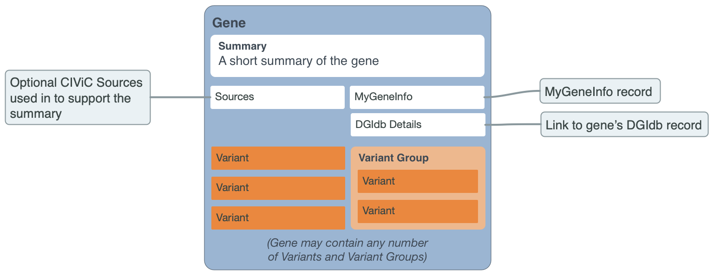

Genes
=====

The gene-level data model within the CIViC database includes three features. The first is a curated gene-level summary with associated sources supporting the summary. The second feature is an external link to The Drug Gene Interaction Database4,5, which can be selected to learn more about specific drug-gene interactions and the druggable genome. The third feature includes gene-level details (e.g., gene aliases, domains, pathways) pulled in from MyGene.info6  with a link to additional MyGene.info details.

.. rubric:: UNDERSTANDING GENES

In order to be listed in CIViC a Gene must have at least one clinical Evidence Item that has been curated from the literature. A new Gene record will be created automatically when the first Evidence Item is assigned to that Gene. The official gene name according to Entrez Gene (assigned by HGNC) is used. Alternative gene names are autopopulated from MyGeneInfo and searchable throughout the database. However, new Evidence Items must be associated with an official gene symbol to reduce ambiguity.

.. rubric:: Gene Attributes

.. list-table::
   :widths: 15 75 10
   :header-rows: 1

   * - Attribute
     - Description
     - Source
   * - Name
     - Entrez symbol of the gene.
     - EntrezDB
   * - Summary
     - User-defined summary of the clinical relevance of this Gene. Curation efforts should aim to concisely summarize the relevance of variants in this gene to treatment prediction, prognosis, and diagnosis. The summary should also provide an overview of the most relevant cancer types. The summary may also include relevant mechanistic information such as pathway interactions, functional alterations caused by variants within this Gene (i.e., activating, loss-of-function, etc.), and normal functions key to its oncogenic properties.
     - CIViC
   * - Sources (PubMed IDs)
     - A list of PubMed IDs referring to evidence supporting statements made in the Gene's description. Source descriptions (e.g. 'Weisberg et al., 2007, Nat. Rev. Cancer') are pulled from the PubMed database at the time of submission, and are not editable.
     - CIViC (PubMed)
   * - **MyGene.Info**
     -
     -
   * - MyGene Info
     - Data retrieved from MyGene.Info using the HGNC symbol as the query. Includes synonyms, protein domains, and pathways with additional data displayed by clicking the "Details" button.
     - MyGene.Info

.. rubric:: CURATING GENES

Most of the information within the gene-level data model is automatically imported after the gene is created. These automatically generated fields include: 1) information from MyGene.info and 2) DGIdb Details. Curators can add gene-level summaries and sources associated with the gene-level summaries. These clinical summaries should include relevant cancer subtypes, specific treatments for the gene’s associated variants, pathway interactions, functional alterations caused by the variants in the gene, and normal/abnormal functions of the gene with associated roles in oncogenesis (Supplementary Figure 1). The sources used for gene-level summaries should be derived from Pubmed IDs.

.. toctree::
   :maxdepth: 2
   :caption: Contents:

   genes/name
   genes/summary
   genes/mygeneinfo
