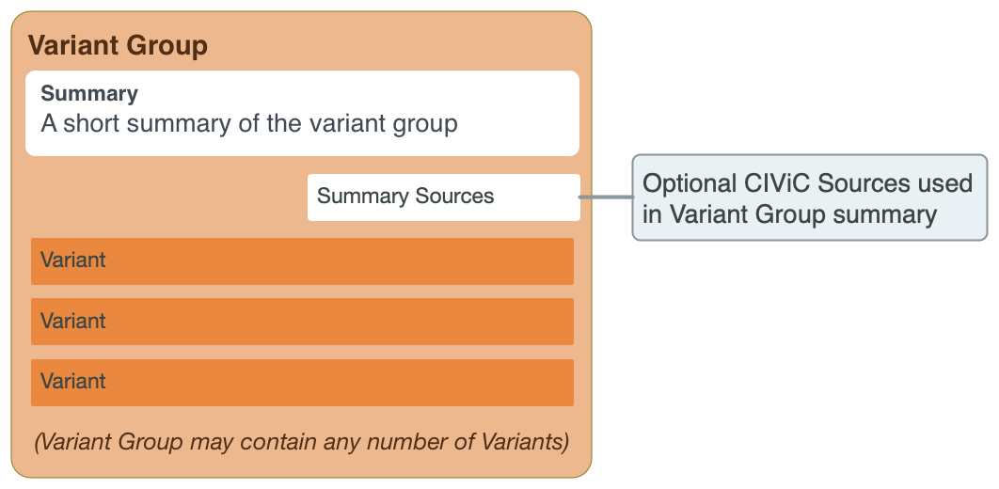

Variant Groups
==============

Variant Groups provide user-defined grouping of Variants within and between genes based on unifying characteristics.

.. rubric:: UNDERSTANDING VARIANT GROUPS

Variant groups allow users to group variants from a single gene or multiple
genes that have similar clinical consequences.

Example uses:

- Variants that confer resistance/sensitivity to a class of drugs (e.g., EGFR
  TKI Resistance)
- Categorical or Bucket Variants (e.g., BRAF V600)
- Variants with strong data to support a very similar effect on protein function
  (e.g., loss-of-function, activating)
- Functional Characteristics (e.g., Fusion Groups)
- Variants that can be effectively combined when considering patient
  outcomes/treatment

Variant groups can associate multiple related variants within or between genes.
Each variant can belong to one or more variant groups, these act to combine
functionally similar or clinically related variants into a single entity. For
example, ‘FGFR Fusions’ is a group that contains several gene fusions where
FGFR2 (or FGFR3) is involved in a fusion with various 3’ partner genes, and
‘Imatinib Resistance Mutations’ is a group of variants that confer resistance
to imatinib treatment. A variant group may also contain variants from multiple
genes. For example, the group ‘EGFR TKI Resistance’ consists of variants in
EGFR, MET, and KRAS.

.. rubric:: Variant Group Attributes

.. list-table::
   :widths: 15 75 10
   :header-rows: 1

   * - Attribute
     - Description
     - Source
   * - Name
     - Name of the Variant Group
     - CIViC
   * - Summary
     - User-defined summary of the clinical relevance of this variant
       group.
     - CIViC
   * - Sources (PubMed IDs)
     - A list of PubMed IDs referring to evidence supporting
       statements made in the Variant Group's description. Source descriptions
       (e.g. 'Weisberg et al., 2007, Nat. Rev. Cancer') are pulled from the
       PubMed database at the time of submission, and are not editable.
     - CIViC (PubMed)
   * - Variants
     - User-defined list of variants in the variant group.
     - CIViC

.. rubric::  CURATING VARIANT GROUPS

Variants within a Variant Group can be derived from different Gene Records.

.. rubric:: Create a Variant Group

Users with Editor or Admin roles are allowed to create a new Variant
Group. To create a new Variant Group use the “Add Variant Group” button
below the list of Variants on any Gene/Variant page. Multiple Variants
from multiple Genes may then be added by using the + button next to the
Variant field. Note that a Variant must exist in CIViC in order to be
added to a Variant Group. To exist, a Variant must have at least one
Evidence Statement. You can add a new Variant by creating a new Evidence
Item using the Add Evidence form.

.. rubric:: Add to a Variant Group

Variants can be added to a Variant Group by using the ‘edit’ function of
a Variant Group.

.. toctree::
   :maxdepth: 2
   :caption: Contents:

   variant_groups/overview
   variant_groups/summary
